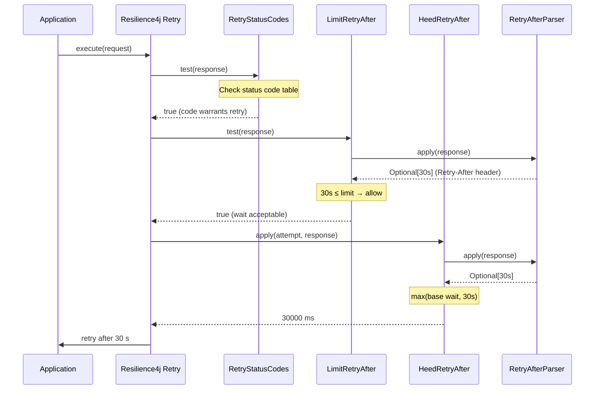
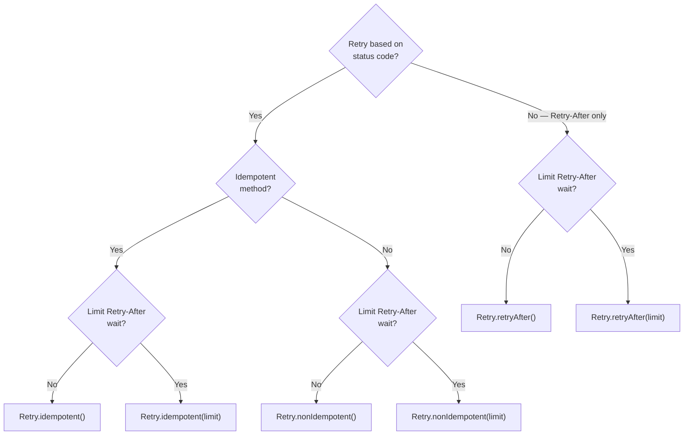
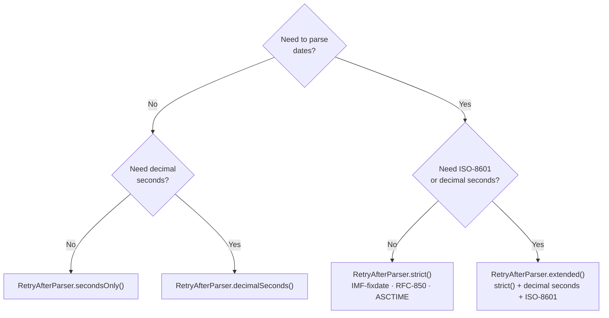
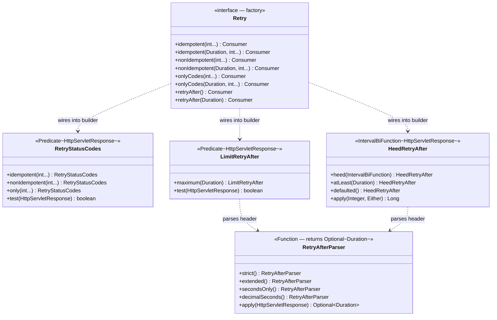

# Add HTTP-awareness to resilience libraries

[Resilience4j](https://resilience4j.readme.io) provides extensive support for patterns including
retries, bulkheads, and circuit breakers. However, that library does not allow for direct
dependency on HTTP APIs and therefore does not include intelligent handling of HTTP response
status codes or `Retry-After` headers. This package integrates with Resilience4j to add those
features in the context of `jakarta.servlet.http.HttpServletResponse`.

## The Problem

Without HTTP awareness, a Resilience4j retry policy retries on any exception or any result
predicate match — it cannot distinguish a `200 OK` that should not be retried from a `503 Service
Unavailable` that should be, and it has no way to respect a `Retry-After` header that tells the
client exactly how long to wait. This package provides the predicates and interval functions that
fill that gap.

## Features

- **Status-code predicates**: `Predicate<HttpServletResponse>` that maps HTTP status codes to
  retry/no-retry decisions, with separate defaults for idempotent and non-idempotent methods
- **`Retry-After` limit**: prevent retries when the server requests a wait longer than your
  configured maximum
- **`Retry-After` interval function**: extend Resilience4j wait intervals to honour the server's
  requested delay, taking the maximum of the two
- **Header parsing**: supports RFC 7231 date formats (IMF-fixdate, RFC-850, ASCTIME) plus optional
  decimal seconds and ISO-8601 instants
- **Factory interface**: `Retry` provides one-call wiring of all of the above into a
  `RetryConfig.Builder`

## Requirements

- Java 17 or higher (Java 25 toolchain used for compilation)

## Installation

The library is published to GitHub Packages. Add the repository and dependency to your
`build.gradle`:

```groovy
repositories {
    maven {
        url = uri("https://maven.pkg.github.com/bhanafee/RetryHTTP")
        credentials {
            username = project.findProperty("gpr.user") ?: System.getenv("GITHUB_ACTOR")
            password = project.findProperty("gpr.key") ?: System.getenv("GITHUB_TOKEN")
        }
    }
}

dependencies {
    implementation 'com.maybeitssquid:RetryHTTP:1.0-SNAPSHOT'
}
```

Or build from source:

```bash
./gradlew build
```

## Quick Start

```java
import com.maybeitssquid.retry.resilience4j.Retry;
import io.github.resilience4j.retry.RetryConfig;
import jakarta.servlet.http.HttpServletResponse;
import java.time.Duration;

// Wire HTTP status codes and Retry-After support into a RetryConfig.
// Waits up to 30 s when the server sends a Retry-After header; skips
// the retry entirely if the requested wait exceeds 30 s.
RetryConfig.Builder<HttpServletResponse> builder = RetryConfig.custom();
Retry.idempotent(Duration.ofSeconds(30)).accept(builder);
RetryConfig<HttpServletResponse> config = builder.maxAttempts(3).build();

// Status-code retry only (no Retry-After support):
RetryConfig.Builder<HttpServletResponse> b2 = RetryConfig.custom();
Retry.idempotent().accept(b2);
RetryConfig<HttpServletResponse> configNoHeader = b2.maxAttempts(3).build();
```

## How It Works

When `Retry.idempotent(limit)` or `Retry.nonIdempotent(limit)` is applied to a builder, it
registers two things: a combined `retryOnResult` predicate (status code check AND `Retry-After`
limit check) and an `intervalBiFunction` that extends the wait to honour the header.



## Which factory method to use?



For a fully custom status code list, replace `idempotent` / `nonIdempotent` with
`Retry.onlyCodes(int... retry)` or `Retry.onlyCodes(Duration limit, int... retry)`.

## HTTP status code

### Default retry decisions

| Status | Idempotent | Non-idempotent | Notes |
|---|---|---|---|
| 1xx | Retry | Retry | Incomplete — continue processing |
| 2xx | No retry | No retry | Success |
| 3xx | Retry | Retry | Redirect — follow to new target |
| 4xx | No retry | No retry | Client error |
| 408 | Retry | Retry | Server confirms request not received |
| 409 | Retry | Retry | Conflict may resolve on retry |
| 425 | Retry | Retry | Server ensures replay safety |
| 429 | Retry | Retry | Server-managed throttle |
| 5xx | **Retry** | **No retry** | Server error — safe only for idempotent |
| 501 | No retry | No retry | Unlikely to change |
| 505 | No retry | No retry | Unlikely to change |

Use `RetryStatusCodes.idempotent(int... additional)` or `RetryStatusCodes.nonIdempotent(int... additional)` directly when you need to override individual codes beyond the defaults.

### Effect of idempotence

Not all requests are safe to retry after a failure. If the method has side effects and there was a
failure on the server, retries could make the problem worse. Retries should be attempted after a
server failure only for idempotent methods as described in section 4.2.2 of
[RFC-7231](https://www.rfc-editor.org/rfc/rfc7231.html#section-4.2.2).

The predicates differ only in their handling of 5xx responses. In most cases, the idempotent
predicate retries `5xx` responses but the non-idempotent does not. However, `501 Not Implemented`
and `505 HTTP Version Not Supported` are never retried because it is extremely unlikely that a
retry would result in a different response.

### Handling expected next request

Some HTTP response codes carry an expectation that the client will react with an additional HTTP
request. For example, when a server responds with a `302` redirection the client is typically
expected to issue a second request to the location specified in the redirect. The server is
responding normally, so it should not be counted as a failure. Some HTTP clients can be configured
to follow redirections silently and automatically. However, this package **does** treat the
additional request as a retry. The reason for this choice is to enable the resilience library to
defend against problematic server behaviors.

One such problematic behavior is a redirect loop. In that condition, URL "A" responds with a
redirect to URL "B," which then redirects back to URL "A," and so on. Counting each redirection as
a retry simplifies identifying and ending the loop with a max retries limit.

Another problematic behavior is when the server response is too slow and the client would not have
time to make the second request and receive a response before running out of time. Rather than
waiting for the time to expire, the client can skip the "retry" and move directly to fallback
logic.

## Retry-After header

Servers may send a `Retry-After` header to indicate the earliest that a client should attempt
another request as described in section 7.1.3 of
[RFC-7231](https://datatracker.ietf.org/doc/html/rfc7231#section-7.1.3). This package provides
two forms of support for the `Retry-After` header: a predicate that can be used to prevent a retry
if the wait interval would be too long, and an interval function that can adjust the wait interval
to heed the header.

### Retry predicate

A `Predicate<HttpServletResponse>` can be configured to block retries if heeding the `Retry-After`
header would result in an unacceptably long delay. Setting a predicate is important. The header can
specify an arbitrary date that could be minutes, hours, or even years in the future, while the
client may be willing to wait at most only a few seconds.

### Wait interval function

A wait interval function is set via an `io.github.resilience4j.core.IntervalBiFunction`. It can be
applied directly by returning the wait duration, or it can be applied as an adjustment to another
`IntervalBiFunction` to ensure that the wait heeds the `Retry-After` header.

The interval function applies the wait interval without considering the length of the delay. To
guard against excessive waits, the function should be applied in conjunction with a predicate that
imposes a limit. The factory methods provided by `com.maybeitssquid.retry.resilience4j.Retry` that
accept a `Duration` include both a function and predicate.

### Parsing `Retry-After` headers

The `Retry-After` header allows the server to request the client delay an integer number of
seconds, or request the client wait until a specific point in time. Choose a parser factory based
on which formats you need to accept:



`LimitRetryAfter.maximum(Duration)` and `HeedRetryAfter` both default to `extended()`. Use the
constructors directly to supply a custom parser.

#### Selecting a clock

When the `Retry-After` header specifies a time, the client has to convert it into a wait interval.
To do this, it requires a clock. By default, it uses the clock supplied by `InstantSource.system()`.
A different source can be supplied when the parser is initialized via
`RetryAfterParser.strict(InstantSource)` or `RetryAfterParser.extended(InstantSource)`.

#### Expanded headers

In addition to the format specified by RFC-7231, the `extended()` parser accepts two variations:

* The delay may use a decimal to specify a delay with more precision than an integer number of seconds.
* The date may use ISO-8601 format.

## Class structure



`RetryStatusCodes`, `RetryAfterParser`, and `LimitRetryAfter` are in
`com.maybeitssquid.retry`. `HeedRetryAfter` and `Retry` are in
`com.maybeitssquid.retry.resilience4j`.

## Technologies

| Component | Version |
|-----------|---------|
| Java | 25 (toolchain; runs on 17+) |
| Gradle | 9.6.1 |
| Resilience4j | 2+ |
| Jakarta Servlet API | 6.1+ |
| SLF4J | 2.+ |
| JUnit | 6.1.0 |
| Mockito | 5.+ |
| JaCoCo | 0.8.14 |

## Links

- [GitHub repository](https://github.com/bhanafee/RetryHTTP)
- [Javadoc](https://bhanafee.github.io/RetryHTTP/javadoc/)
- [Test Results](https://bhanafee.github.io/RetryHTTP/tests/)
- [Coverage Report](https://bhanafee.github.io/RetryHTTP/coverage/)
- [Code of Conduct](https://bhanafee.github.io/RetryHTTP/CODE_OF_CONDUCT.html)
- [Claude Code guidance](https://bhanafee.github.io/RetryHTTP/CLAUDE.html)

---

**License:** [](LICENSE)
